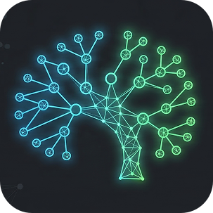
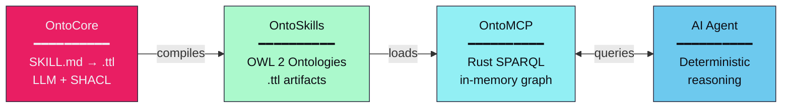

<p align="center">
  
</p>

<h1 align="center">
  <a href="https://ontoskills.sh" style="text-decoration: none; color: inherit; display: flex; align-items: center; justify-content: center; gap: 10px;">
    
    <span>OntoSkills</span>
  </a>
</h1>

<p align="center">
  <b>🇬🇧 English</b> • <a href="README_zh.md">🇨🇳 中文</a>
</p>

<p align="center">
  <strong>The <span style="color:#e91e63">deterministic</span> enterprise AI agent platform.</strong>
</p>

<p align="center">
  Neuro-symbolic architecture for the Agentic Web — <span style="color:#00bf63;font-weight:bold">OntoCore</span> • <span style="color:#2196F3;font-weight:bold">OntoMCP</span> • <span style="color:#9333EA;font-weight:bold">OntoStore</span>
</p>

<p align="center">
  <a href="https://ontoskills.sh/docs/overview/">Overview</a> •
  <a href="https://ontoskills.sh/docs/getting-started/">Getting Started</a> •
  <a href="https://ontoskills.sh/docs/roadmap/">Roadmap</a> •
  <a href="PHILOSOPHY.md">Philosophy</a>
</p>

<p align="center">
  
  
  
  
  <a href="#license">
    
  </a>
</p>

---

## What is OntoSkills?

OntoSkills transforms natural language skill definitions into **validated OWL 2 ontologies** — queryable knowledge graphs that enable deterministic reasoning for AI agents.

**The problem:** LLMs read skills probabilistically. Same query, different results. Long skill files burn tokens and confuse smaller models.

**The solution:** Compile skills to ontologies. Query with SPARQL. Get exact answers, every time.



---

## Why OntoSkills?

| Problem | Solution |
|---------|----------|
| LLMs interpret text differently each time | SPARQL returns exact answers |
| 50+ skill files = context overflow | Query only what's needed |
| No verifiable structure for relationships | OWL 2 formal semantics |
| Small models can't read complex skills | Democratized intelligence via graph queries |

**For 100 skills:** ~500KB text scan → ~1KB query

[→ Read the full philosophy](PHILOSOPHY.md)

---

## Quick Start

```bash
# Install the MCP runtime and bootstrap your client
npx ontoskills install mcp --claude

# Or install the Python compiler separately
pip install ontocore
ontocore compile
```

[→ Full installation guide](https://ontoskills.sh/docs/getting-started/)

---

## Components

| Component | Language | Description |
|-----------|----------|-------------|
| **OntoCore** | Python | Neuro-symbolic compiler: SKILL.md → OWL 2 ontology |
| **OntoMCP** | Rust | MCP server with sub-ms SPARQL queries |
| **OntoStore** | GitHub | Versioned skill registry |
| **CLI** | Node.js | One-command installer (`npx ontoskills`) |

---

## Documentation

- **[Overview](https://ontoskills.sh/docs/overview/)** — What is OntoSkills and why it matters
- **[Getting Started](https://ontoskills.sh/docs/getting-started/)** — Installation and first steps
- **[Architecture](https://ontoskills.sh/docs/architecture/)** — How the system works
- **[Knowledge Extraction](https://ontoskills.sh/docs/knowledge-extraction/)** — Extracting value from skills
- **[OntoStore](https://ontoskills.sh/ontostore/)** — Browse and install skills
- **[Roadmap](https://ontoskills.sh/docs/roadmap/)** — Development phases

---

## <a id="license"></a>License

MIT License — see [LICENSE](LICENSE) for details.

*© 2026 [MareaSW](https://ontoskills.sh)*
